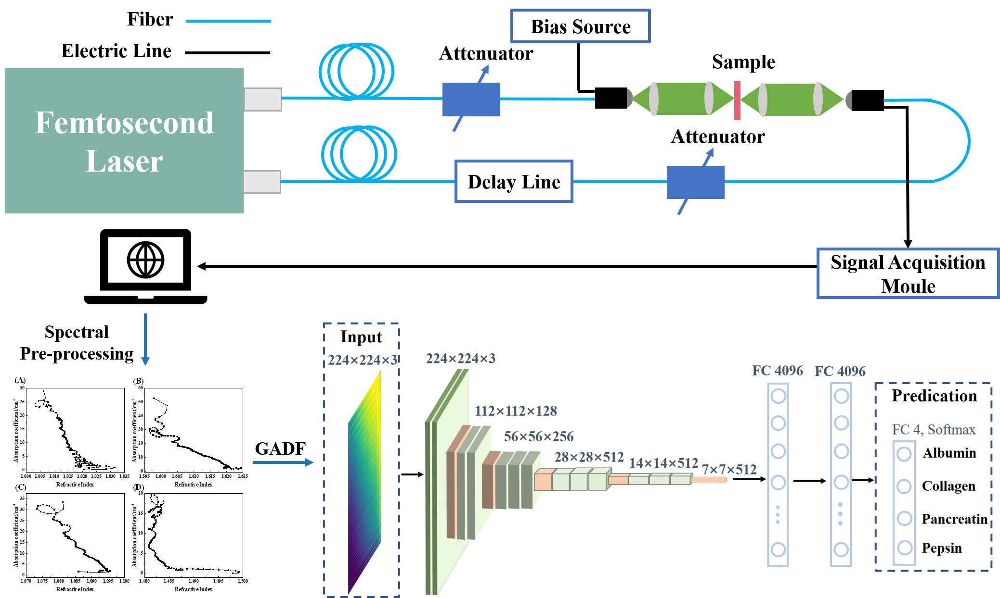

# Neural-network Model
We propose an intelligent protein detection approach: combining both Terahertz time-domain spectroscopy (THz-TDS) with visual geometry group 16 (VGG-16) neural network to distinguish four proteins: albumin, collagen, pepsin, and pancreatin.

  

A deep learning/machine learning tool for classifying rotational/THz spectra of proteins.

# Funding

This work was supported by  the National Key Research and Development Program of China (Grant No. 2021YFB3200100).

# Developer

Yusa Chen

# Data and Supervision

Wengang Wu

# Publication
Will be cited when available
